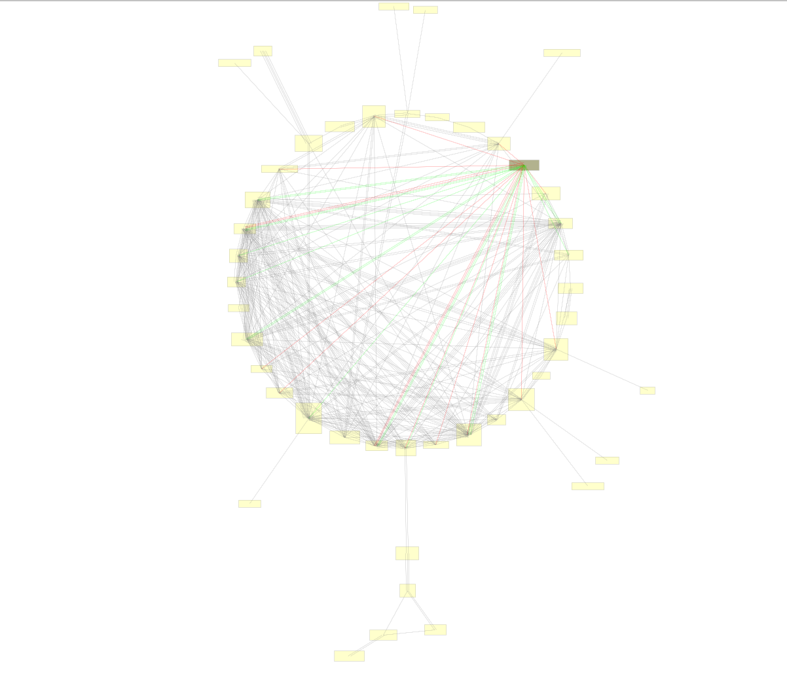

# Automatic Database Structure Discovery

This code arose out of a very squeezed consulting project, in which my team was required to provide automated transaction monitoring for a financial client in a very short period of time. 

Their database contained 66 tables, and was in general a giant disaster - no data dictionary or data expert within the company, inconsistent column naming, NULL value traps everywhere.

This repo contains the code which I wrote to perform automated structure discovery within the database. Specifically, the code aims to discover the specific ID columns which can be used to join tables to one another.

Here is a visualisation of the table connections which were discovered:



What the code in this repo does is:

1. Evaluate every possible pair of columns in the entire database as potential matching join keys.

2. Calculate various matching metrics for each potentially matching column pair.

3. Apply thresholding criteria to decide which pairs of columns constitute a useful joining pair (i.e. matching IDs useful for joining tables).

4. Export the discovered structure as a SQLite database containing empty tables with foreign key constraints, so that the table relationships can be visualised, navigated and explored using any chosen database visualisation tool.

5. Model the connected tables as a graph, so that multi-step join paths between tables can be discovered.

This code was written with great haste, and as a result code documentation is quite low (and testing is non-existent). I would love to return to this code again at a later stage and optimise, scale and improve it.

In particular, the join-key discovery part of the code uses for loops in native python and will be prohibitively slow on larger databases (I'd like to rewrite it in duckdb, or something similar). The code is fast enough for .jsonl files up to a few hundred megabytes each. 

I will definitely use this code again whenever I am faced with a giant mysterious documentationless database.

The expected input data format expected by this codebase is:

* .jsonl files in the folder /data_input/

* One .jsonl file per table in the database

* Each line of the .jsonl file is a single row of the table e.g. {"col1":"value1", "col2":"value2"} etc. 

Below is the (python) code which I used to run the process:

Set up the logger:
```python
import logging
logging.basicConfig(
    level=logging.INFO,
    format="%(asctime)s - %(name)s - %(levelname)s - %(message)s",
)
```

Pivot the row-wise .jsonl files into a column format:
```python
import pathlib
import time
import src.transform_data

start_time = time.perf_counter()
for path in pathlib.Path("data_input").iterdir():
    if path.is_file():
        src.transform_data.pivot_jsonl(
            input_filepath=path,
            output_filepath=f"temp_storage/{path.stem}.json",
    )
    elif path.is_dir():
        print(f"Skipped directory {path}/") 

print(f"Finished pivoting .jsonl files in {(time.perf_counter()-start_time)/60:,.1f} minutes")
```

Compare all possible column pairs:
```python
import json
import pathlib
import time

import src.discover

table_data = {}

start_time = time.perf_counter()
for path in pathlib.Path("temp_storage").iterdir():
    if path.is_file() and path.suffix==".json":
        with open(path, "r", encoding="utf-8") as file:
            table_data[path.stem] = json.load(file)

print(f"Finished reading in data in {(time.perf_counter()-start_time)/60:,.1f} minutes")

start_time = time.perf_counter()
src.discover.join_keys(
    tbl_contents=table_data,
    n_samples=500,
    allowed_key_types=(int, str),
    output_path="output/discover/join_keys/all_matches.json",
)
print(f"Finished discovering join keys in {(time.perf_counter()-start_time)/60:,.1f} minutes")
```

Decide which column pairs are sufficiently matching to be considered as useful join keys:
```python
import time

import src.decision
from src.decision.comparison_operators import greater_than, less_than

start_time = time.perf_counter()
src.decision.join_keys(
    input_data_filepath="output/discover/join_keys/all_matches.json",
    min_match_criteria=(
        ("matches", "exactly_1_match_in_lookup", "percent", (greater_than, 0.1)),
        ("sampled_col", "sample_size", "percent_null", (less_than, 0.95)),
        ("sampled_col", "sample_size", "n_unique/n_rows", (greater_than, 0.5)),
        ("lookup_col", "size", "percent_null", (less_than, 0.95)),
        ("sampled_col", "sample_size", "n_unique", (greater_than, 4)),
        ("lookup_col", "size", "n_unique", (greater_than, 4)),
    ),
    output_filepath="output/decision/join_keys/identified_join_keys.json"
)

print(f"Finished making join key decisions in {(time.perf_counter()-start_time)/60:,.1f} minutes")
```

Save the identified join keys in a useable CSV format:
```python
import src.dataviz
src.dataviz.join_key_decisions_to_csv(
    input_data_filepath="output/decision/join_keys/identified_join_keys.json",
    output_filepath="output/dataviz/join_key_decisions_to_csv/identified_join_keys.csv",
)
```

Create a SQLite database of empty tables with the identified join keys defined foreign key constraints - this can be visualised using any database visualisation tool
(I used [dbvisualiser](https://www.dbvis.com/), which worked amazingly):
```python
import json
import time

import src.dataviz

start_time = time.perf_counter()
with open("output/decision/join_keys/identified_join_keys.json", "r", encoding="utf-8") as file:
    join_cols_identified = json.load(file)

src.dataviz.make_sqlite_skeleton(
    col_pairs=join_cols_identified,
    output_db_path="output/dataviz/make_sqlite_skeleton/identified_join_keys.db",
) 
print(f"Exported SQLite db skeleton in {(time.perf_counter()-start_time)/60:,.1f} minutes")
```

Discover multi-step table connections by modelling the whole system as a graph:
```python
import src.discover.table_links
import src.transform_data.table_link_paths_to_csv

src.discover.table_links.create_db(
    input_data_filepath="output/decision/join_keys/identified_join_keys.json",
    max_path_len=4,
    output_filepath="output/discover/table_links/create_db/table_link_paths.pickle",
)

src.transform_data.table_link_paths_to_csv(
    input_data_filepath="output/discover/table_links/create_db/table_link_paths.pickle",
    output_filepath="output/transform_data/table_links_to_csv/table_link_paths.csv",
)
```
